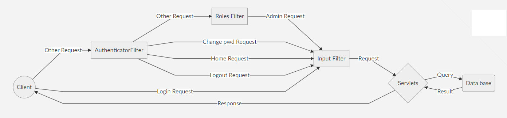
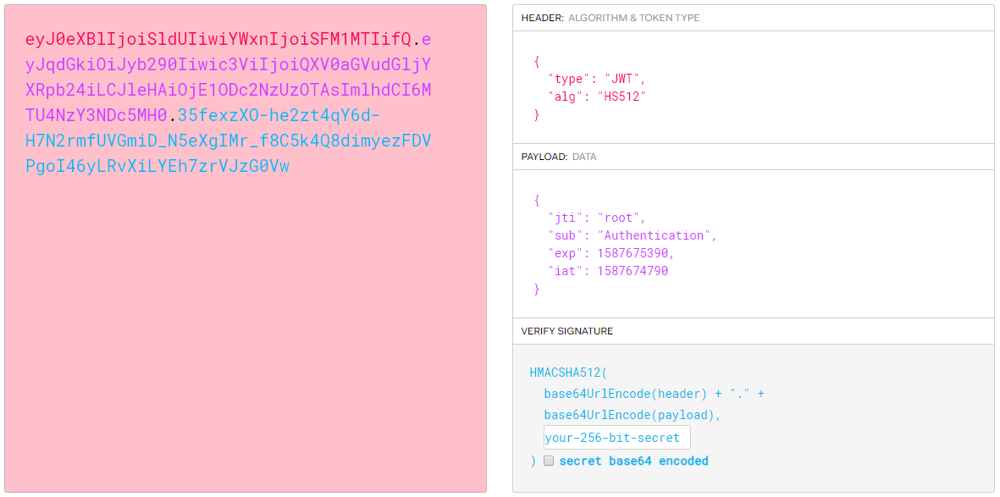
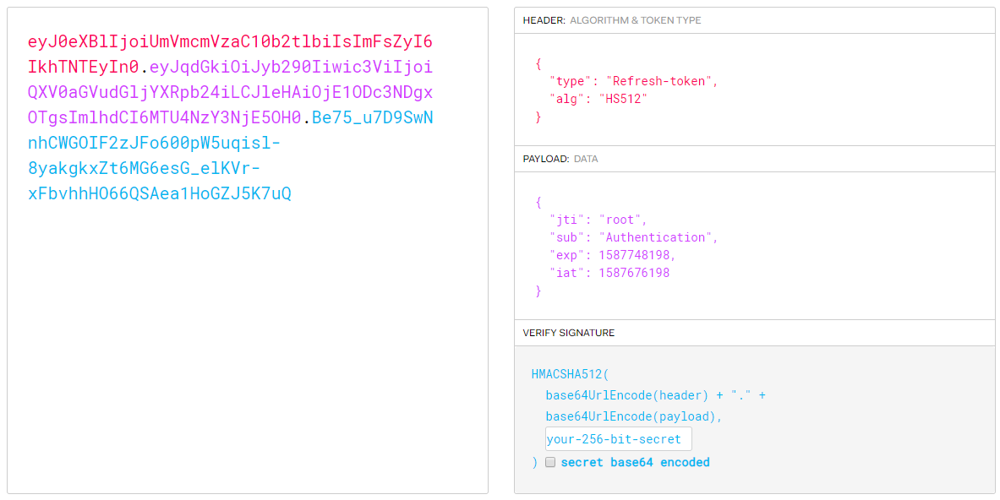
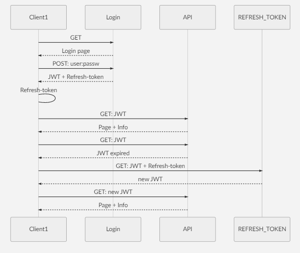
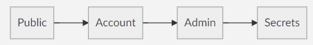

# Software Security - Authentication (TP1)
Authentication is the mechanism that allows a system to convince itself that some actor is acting under the authority (and responsibility) of a given principal, that the given actor is the “authentic” principal.
The authenticator is the component of the application security infrastructure responsible by authentication.

---

## Quick start

### Clonar repositório
```bash
cd webapps
git clone https://github.com/rfa-lopes/SS-TP1.git
```

### Instalar configurações TLS
```bash
cd webapps
cp -f ../conf/server.xml /SS-TP1/TLS/server.xml
```

### Instalar MariaDB-Windows10 (opcional)
**Nota**: SQLite está pronto a testar sem instalações apriori. Caso não se queira perder tempo com instalações do MariaDB, basta configurar o servidor para que use SQLite, para isso troque a variavel USE_MARIA para *false* [aqui](src/Config/Configs.java).
```bash
cd webapps
cp -f ../conf/server.xml /SS-TP1/TLS/server.xml
```

### Correr servidor
```bash
cd bin
catalina.bat run
chrome.exe https://localhost:8443/SS-TP1
```

### Credênciais
* admin: root
* password: toor

---

## Diretorias
* /WEB-INF - Compilado.
* /WEB-INF/database - Base de dados.
* /src - Código fonte.
* /TLS - Ficheiros para configurações TLS

---

## TLS - ficheiros [aqui](/TLS/)
* Algorithm: RSA
* Key alias: ServerCert
* Keystore: ServerKeyStore.jks
* Keystore password: changeit
* Key size: 4096
* Store type: pkcs12

Comando para criar a keystore [aqui](/TLS/commands.txt)

---

## Arquitectura
### Filtros
Para uma maior segurança adicionámos três filtros ao nosso sistema, um que fica encarregue de autenticar o utilizador de modo a saber quem este é (Authenticator Filter); outro cuja sua função é a verificação de privilégios para que cada utilizador tenha acesso apenas às funcionalidades que lhe são dirigidas (Roles Filter); e por fim, e para mitigar por completo ataques como SQL Injection e XSS, adicionamos um filtro que fica encarregue de monitorizar todo o input vindo dos utilizadores (Input Filter). Para facilitar em seguida temos uma visualização geral de como estes são usados de acordo com o tipo de pedido que o sistema recebe.



### Sistema de tokens (JWT)
Entre as duas opções que ponderamos (JWT ou Session Cookie), escolhemos a JWT por ser uma implementação mais desafiante e que nos obrigou a resolver alguns problemas. Também entendemos desde logo que utilizando JWT não precisariamos proteger a memória do sistema, sendo que cada cliente guarda as suas cookies e não o servidor (como acontece utilizando Sessions Cookies). Estes JWT são assinados pelo servidor e contém informação útil para o servidor autenticar o cliente. O nosso JWT foi implementado com o aspecto seguinte:



Como se pode ver na figura anterior, o JWT é contituido em 3 componentes:

#### HEADER
Onde contém informação sobre o token, o seu tipo (JWT) e o algoritmo utilizado na assinatura deste. Pensamos que esta informação poderia ser secreta de modo a não fornecer ao atacante qualquer tipo de informação sobre o token de modo a mitigar ainda mais possiveis ataques.

#### PAYLOAD
Onde está a informação do cliente útil para a sua autenticação. Pesquisamos sobre que tipo de informação poderia conter o payload no RFC 7519 que pode ser visto [aqui](https://tools.ietf.org/html/rfc7519#page-8).
* JTI - Username do utilizador.
* SUB - Assunto do token.
* EXP - Data em que em que expira.
* IAT - Data em que foi criado.

#### SIGNATURE
A assinatura de todo o token (Header + Payload) serve para o servidor poder verificar a sua integridade, de modo a mitigar possiveis ataques de adulteração.

Após a implementação deste tipo de autenticação e depois de alguma pesquisa, fomos confrontados com o facto de que meter a password de X em X tempos (sendo X a diferença entre EXP e IAT) é algo inconveniente para um utilizador que poderá utilizar este sistema várias vezes por dia. Para isso decidimos implementar uma extenção ao nosso sistema de tokens, adicionado ao JWT um Refresh Token, que tem como objetivo servir como token de autenticação para uma revalidação de um token JWT sem que o utilizador se apreceba e continua a sua intereção com o sistema de modo transparente e seguro, visto que este fica guardado de forma segura (Utilizando a flag httpOnly de modo a mitigar ataques XSS) em local storage no browser do cliente e só é usado para revalidar novos JWT token. O Refresh Token tem o aspecto seguinte:



É possivel verificar que a estrutura é semelhante à do JWT utilizado nos pedidos normais, com a diferença que este têm um tempo de expiração muito maior que poderá rondar os 14 a 60 dias, sendo que na nossa aplicação preferimos reduzir esse tempo a 20 horas, sendo este facilmente modificado no ficheiro de configurações e segredos [aqui](src/Config/Configs.java).

A implementação deste sistema pode ser visto na figura seguinte, onde simulamos alguns pedidos do cliente ao sistema.



**Nota**: Para a mitigação de eventuais ataques aos sistema de tokens, decidimos utilizar encriptação simétrica de forma a esconder a informação deste token e eventuais informações relevantes a possiveis atacantes. A chave utilizada para este feito tem um tamanho de 128 bits (16 bytes) para que haja uma maior agilização e rapidez na encriptação e decriptação destes tokens de modo não perder mais velocidade na resposta ao cliente.

### Base de dados

#### Accounts table
username  | passwordHash            | isloggedin | islocked |  usertype
  --------| ------------------------|------------|----------|-------------
  root    | Af3ddsIjq...Lfg41Hg==   |     1      |    0     | ADMIN
  Rodrigo | qgUS75wu2...OX2yZuA==   |     0      |    0     | ACCOUNT
  Miguel  | 4fQDlIjq3...uyOX1Hg==   |     0      |    1     | ACCOUNT
  
**Nota:** [passwordHash] = password do utilizador mais 'salt', de forma a que passwords iguais entre utilizadores diferentes não apareção iguais na base de dados.

Exemplo:

username  | passwordHash            |passwordText| 
  --------| ------------------------|------------|
  user1   | Af3ddsIjq...Lfg41Hg==   |     123456 |
  user2   | qgUS75wu2...OX2yZuA==   |     123456 |

---
## Estrutura de Confidencialidade



Dividimos a estrutura de confidencialidade em 4 entidades: 
* *Public*, onde qualquer entidade tem acesso. Aqui a única funcionalidade permitida é o Login.

* *Account*, que são as contas dos utilizadores que estão autenticados. São permitidas interações com: Logout, Change-password e todas de dominio público.

* *Admin*, sendo este o administrador do sistema, tem poder epara operar em qualquer funcionalidade oferecida pelo sistema, que são: Create-account, remove-account, get-account, lock-account e todas as anteriormente mencionadas.

* *Secrets*. Achamos por bem acrescentar esta "entidade" sendo este o sistema em si, e o único que têm acesso às chaves de encriptação, assinaturas, etc.

---

## Funcionalidades
* Login
* Logout
* Mudar password de uma conta
* Criar conta (admin)
* Apagar conta (admin)
* Obter dados de uma conta (admin)
* Bloquear um utilizador (admin)

---

## EXTRAS
* Número máximo de tentativas de passwords incorretas utilizando remote address.
* Implementação com Refresh token.
* Encriptação de tokens (configurável)
* Ficheiros JSP.
* Mecanisco de Anti-SQLInjection / XSS (inputFilter)

---

## Ferramentas e Tecnologias
* [Intelliji](https://www.jetbrains.com/idea/)
* [SQLite](https://www.sqlite.org/download.html)
* [Tomcat 8.5.53](https://tomcat.apache.org/)
* [BurpSuit](https://portswigger.net/burp)

---

## Informação adicional

### Comandos Git
```bash
https://github.com/rfa-lopes/SS-TP1.git
git pull origin master
git add .
git commit -m "Initial commit"
git push
git rm -r --cached Path/to/directories
```

### Autores
* Rodrigo Lopes - rfa.lopes@campus.fct.unl.pt
* Miguel Teodoro - mt.moreira@campus.fct.unl.pt
